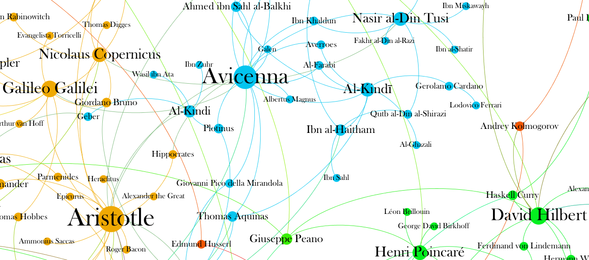

{: .mb-2 }
Faculty of Mathematical Sciences, Ferdowsi University of Mashhad 
{: .mb-0 .fs-6 .text-grey-dk-000 }

<h3 class="staffer-name" id="mahmood-amintoosi"> <a href="#mahmood-amintoosi" class="anchor-heading" aria-labelledby="mahmood-amintoosi"><svg viewBox="0 0 16 16" aria-hidden="true"><use xlink:href="#svg-link"></use></svg></a> <a href="https://mamintoosi.github.io/">Mahmood Amintoosi</a></h3>
<a href="mailto:m.amintoosi@um.ac.ir">m.amintoosi@um.ac.ir</a>

<a href="https://calendly.com/m-amintoosi/30min" class="btn btn-outline">Schedule an appointment</a>

## Resources

- [Books](https://fumdrive.um.ac.ir/index.php/s/QekZq7oyrSE3ksM)
- [Videos](https://fumdrive.um.ac.ir/index.php/s/xPcbsJ86xrcB3Si)

## Libraries

- **PyTorch Geometric (PyG)**: [PyTorch Geometric](https://pytorch-geometric.readthedocs.io/)
- **Deep Graph Library (DGL)**: [Deep Graph Library](https://www.dgl.ai/)
- **Spektral**: [Spektral](https://graphneural.network/)
- **Jraph**: [Jraph](https://github.com/deepmind/jraph)
<!-- - **Graph Nets**: [Graph Nets](https://github.com/deepmind/graph_nets) -->

## Persons

### Jure Leskovec

* [Google Scholar](https://scholar.google.com/citations?user=Q_kKkIUAAAAJ&hl=en)
* [Stanford Profile](https://profiles.stanford.edu/jure-leskovec)
* [GNN Course](https://web.stanford.edu/class/cs224w/)

### Petar Veličković

* [Personal web site](https://petar-v.com/)
* [Traffic prediction with advanced Graph Neural Networks](https://deepmind.google/discover/blog/traffic-prediction-with-advanced-graph-neural-networks/)
* [Geometric Deep Learning](https://geometricdeeplearning.com/)
* [Everything is Connected: Graph Neural Networks](https://arxiv.org/pdf/2301.08210)

Graph of mathematcians, [Source:](https://griffsgraphs.wordpress.com/2012/07/10/the-graph-of-mathematicians/)
